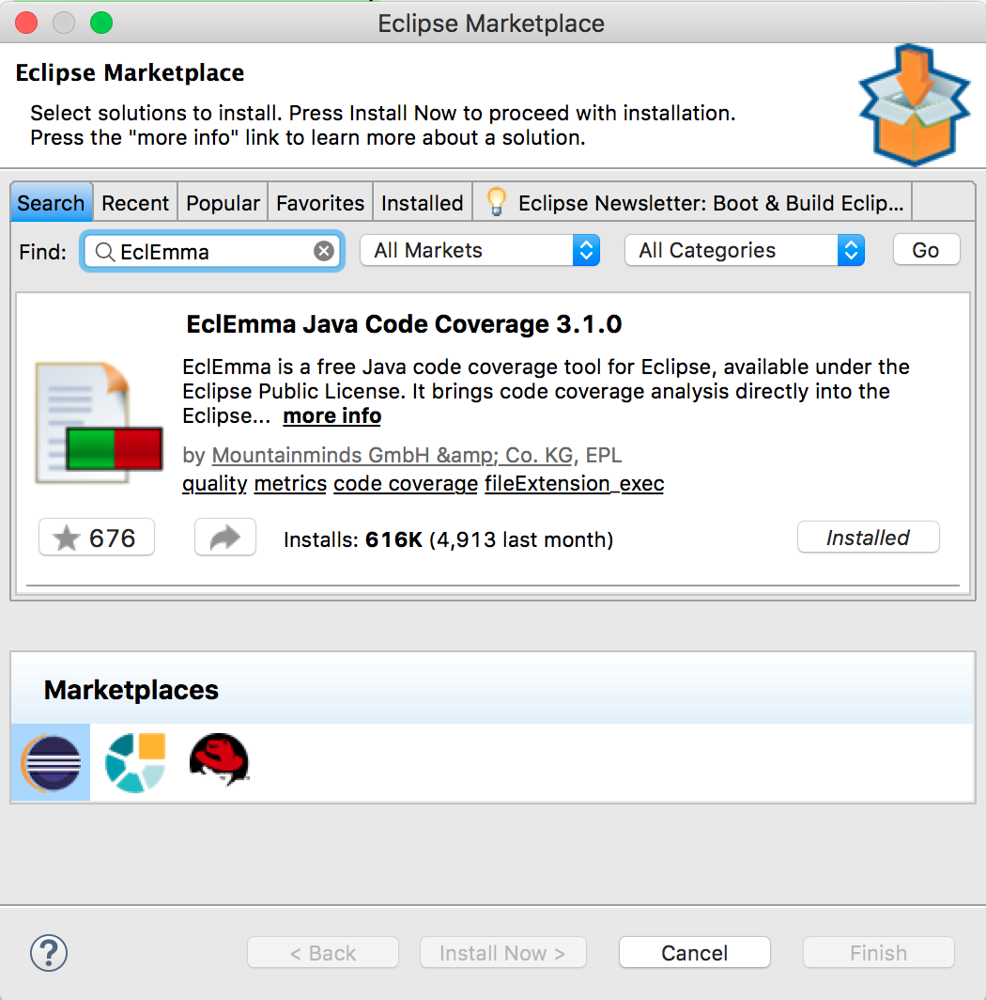

# RefactoringList - Rafactoring example 1


## Setup 

### import project

In Eclipse, import this as a Maven project.

`File > Import > Maven > Existing Maven Projects`

### tools
Make sure that [`EclEmma`](https://www.eclemma.org) is installled in Eclipse. `Eclipse IDE for Java Developers` comes with it.
You can check `Help > Eclipse Market Place`.



### shortcut

In `Eclipse > Preferences > Keys`, assign `Rerun JUnit Test` a short cut `OPT+CMD+0`

## Legacy code

[List.java](src/main/java/original/List.java)

```
package original;

public class List {
	private Object[] elements = new Object[10];
	private boolean readOnly;
	private int size = 0;

	public void add(Object element) {
		if (!readOnly) {
			int newSize = size + 1;
			
			if ( newSize > elements.length) {
				Object[] newElements = new Object[elements.length + 10];
				for (int i = 0; i < size; i++) {
					newElements[i] = elements[i];
				}

				elements = newElements;
			}

			elements[size] = element;
			size++;
		}
	}

	public int size() {
		return size;
	}

	public Object get(int index) {
		return elements[index];
	}
}
```

## Identify `Code Smell`

* https://en.wikipedia.org/wiki/Code_smell
* "Refactoring: Improving the Design of Existing Code" by Martin Fowler


## Refactoring

| Smell        | Fix (shortcut)        | Result |
| ------------- | ------------- | ------------- |
| Magic Number  10   | [Extract Constant](fe7aab2e1da8b36f0cb64c94811b9f319c728a71)  | INITIAL_STORE_SIZE |
| Magic Number  10   | Extract Constant | STORE_SIZE_INCREMENT |
